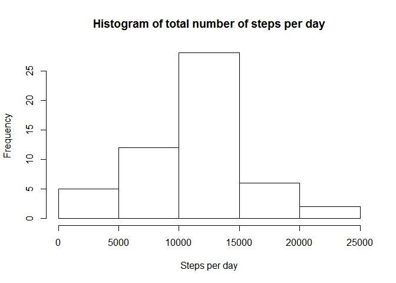
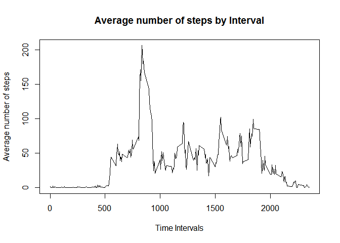
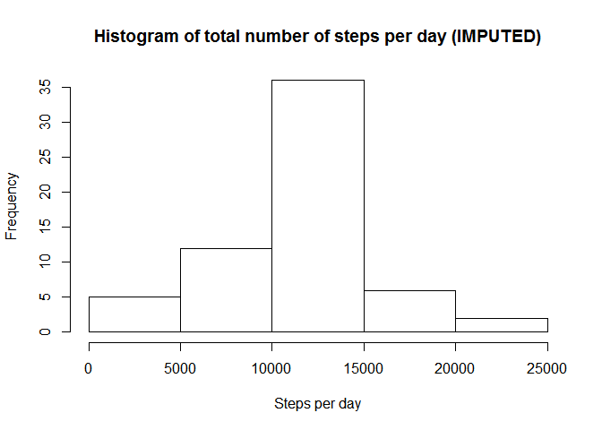
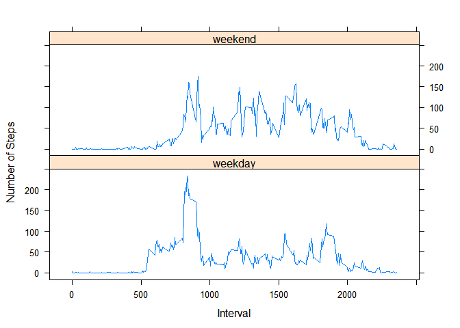

# Reproducible Research: Peer Assessment 1


## Loading and preprocessing the data

```r
setwd("D:\\Reporducible research\\Data")
activitydata <- read.csv("activity.csv", as.is = TRUE)

#Converting the date to a valid R date object.
activitydata$date <- as.Date(activitydata$date)

#Remove the NA values and store ia good data set
filledactivity <- activitydata[complete.cases(activitydata), ]
```


## What is mean total number of steps taken per day?

```r
# Calculate the total number of steps taken per day
stepsperday <- aggregate(steps ~ date, filledactivity, sum)

# Create a histogram of no of steps per day
hist(stepsperday$steps, main = "Histogram of total number of steps per day", xlab = "Steps per day")
```

 

```r
#Calculate mean and median steps per day 
round(mean(stepsperday$steps))
```

```
## [1] 10766
```

```r
round(median(stepsperday$steps))
```

```
## [1] 10765
```

## What is the average daily activity pattern?


```r
# Calculate average steps per interval for all days 
avgstepsperinterval <- aggregate(steps ~ interval, filledactivity, mean)


# Plot the time series with appropriate labels and heading
plot(avgstepsperinterval$interval, avgstepsperinterval$steps, type='l', col=1, main="Average number of steps by Interval", xlab="Time Intervals", ylab="Average number of steps")
```

 

```r
# Find the index and the maximum value
intervalidx <- which.max(avgstepsperinterval$steps)
avgstepsperinterval[intervalidx, ]$interval
```

```
## [1] 835
```

```r
round(avgstepsperinterval[intervalidx, ]$steps, digits = 1)
```

```
## [1] 206.2
```

## Imputing missing values

```r
#Calculate the number of rows with missing values
missing_value_act <- activitydata[!complete.cases(activitydata), ]
nrow(missing_value_act)
```

```
## [1] 2304
```

```r
# Loop thru all the rows of activity, find the one with NA for steps.
# For each identify the interval for that row
# Then identify the avg steps for that interval in avg_steps_per_interval
# Substitute the NA value with that value

for (i in 1:nrow(activitydata)) {
    if(is.na(activitydata$steps[i])) {
        val <- avgstepsperinterval$steps[which(avgstepsperinterval$interval == activitydata$interval[i])]
        activitydata$steps[i] <- val 
    }
}

# Aggregate the steps per day with the imputed values
stepsperdayimpute <- aggregate(steps ~ date, activitydata, sum)

# Draw a histogram of the value 
hist(stepsperdayimpute$steps, main = "Histogram of total number of steps per day (IMPUTED)", xlab = "Steps per day")
```

 

```r
# Compute the mean and median of the imputed value
# Calculate the mean and median of the total number of steps taken per day
round(mean(stepsperdayimpute$steps))
```

```
## [1] 10766
```

```r
median(stepsperdayimpute$steps)
```

```
## [1] 10766.19
```
## Are there differences in activity patterns between weekdays and weekends?


```r
days <- weekdays(filledactivity$date)
weekend <- (days == "Saturday" | days == "Sunday")
dayfactor <- factor(weekend, labels = list("weekday", "weekend"))
filledactivity$daytype <- dayfactor

groupedactivity <- aggregate(filledactivity$steps, list(DayType = filledactivity$daytype, 
    Interval = filledactivity$interval), mean)
library(lattice)
xyplot(groupedactivity$x ~ groupedactivity$Interval | groupedactivity$DayType, layout = c(1, 
    2), xlab = "Interval", ylab = "Number of Steps", type = "l")
```

 
